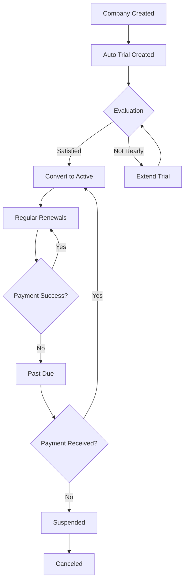

## Overview

Subscription Management allows administrators to view and update their company's subscription plan, status, billing cycle, and user limits. The subscription determines which features are available, including AI diagnostic capabilities.

<Warning>
  Only users with the **admin** role can access and modify subscription settings. Workers cannot view or edit subscription information.
</Warning>

### What You Can Control

- Subscription plan level (Starter, Pro, Enterprise, Developer Test)
- Subscription status (Active, Trial, Past Due, Canceled, Suspended)
- Billing cycle (Monthly, Yearly)
- Start and end dates
- User limit for your company

## Accessing Subscription Settings

Navigate to **Admin** → **Suscripción** (Subscription) from the main menu. The subscription form displays with current settings.

<Note>
  If no subscription exists for your company, the system automatically creates a default trial subscription when you first access this page.
</Note>

## Subscription Plans

ElectroFix AI offers four plan tiers:

<CardGroup cols={2}>
  <Card title="Starter" icon="seedling">
    **Basic repair shop features**
    
    - Orders, Customers, Equipment management
    - **No AI diagnostics**
    - Limited to basic operational modules
    - Best for small shops starting out
  </Card>
  
  <Card title="Pro" icon="chart-line">
    **Professional features**
    
    - All Starter features
    - **No AI diagnostics**
    - Advanced reporting (if implemented)
    - Suitable for established businesses
  </Card>
  
  <Card title="Enterprise" icon="building">
    **Full feature set with AI**
    
    - All Pro features
    - **AI diagnostics enabled**
    - Monthly query and token limits
    - API access (if implemented)
    - Priority support
  </Card>
  
  <Card title="Developer Test" icon="code">
    **Internal testing plan**
    
    - All Enterprise features
    - **AI diagnostics enabled**
    - Higher limits for testing
    - Not for production use
  </Card>
</CardGroup>

### AI Feature Availability

AI-powered diagnostics are **only available** on:
- ✅ Enterprise
- ✅ Developer Test

**Not available** on:
- ❌ Starter
- ❌ Pro

## Subscription Form Fields

<ParamField path="plan" type="select" required>
  **Plan**
  
  Your subscription tier.
  
  **Options**:
  - `starter` - STARTER
  - `pro` - PRO
  - `enterprise` - ENTERPRISE
  - `developer_test` - DEVELOPER_TEST
  
  <Warning>
    Downgrading from Enterprise/Developer Test to Starter/Pro will disable AI diagnostics. Existing AI data remains but new requests will be blocked.
  </Warning>
</ParamField>

<ParamField path="status" type="select" required>
  **Status**
  
  Current state of the subscription.
  
  **Options**:
  - `active` - ACTIVE: Fully operational, all features enabled
  - `trial` - TRIAL: Evaluation period, full features with time limit
  - `past_due` - PAST_DUE: Payment issue, limited functionality
  - `canceled` - CANCELED: Subscription terminated, data retained
  - `suspended` - SUSPENDED: Temporarily disabled by admin/system
  
  <Note>
    Status affects system behavior. Canceled or suspended subscriptions may restrict module access.
  </Note>
</ParamField>

<ParamField path="billing_cycle" type="select" required>
  **Billing Cycle**
  
  How frequently subscription renews.
  
  **Options**:
  - `monthly` - MONTHLY: Renews every month
  - `yearly` - YEARLY: Renews annually
  
  Typically:
  - Monthly = standard pricing
  - Yearly = discounted rate (2 months free)
</ParamField>

<ParamField path="starts_at" type="date" required>
  **Start Date**
  
  When the current subscription period began.
  - Date format: YYYY-MM-DD
  - Should be in the past for active subscriptions
  - Used to calculate billing anniversaries
  
  **Example**: `2026-03-01`
</ParamField>

<ParamField path="ends_at" type="date" required>
  **End Date**
  
  When the current subscription period expires.
  - Date format: YYYY-MM-DD
  - Must be after or equal to start date
  - System checks this for auto-renewal
  - For trials: typically 30 days from start
  
  **Example**: `2026-04-01`
  
  <Warning>
    When end date passes, system may auto-suspend or downgrade the subscription depending on payment status.
  </Warning>
</ParamField>

<ParamField path="user_limit" type="number">
  **User Limit**
  
  Maximum number of users (admins + workers) allowed.
  - Optional field
  - Integer value
  - Minimum: 1
  - Maximum: 100,000
  - Leave empty for unlimited
  
  Plan defaults:
  - Starter: typically 3-5 users
  - Pro: typically 10-25 users
  - Enterprise: typically 50+ users
  - Developer Test: unlimited
  
  <Note>
    System may prevent creating new workers if this limit is reached. Deactivate unused workers to free up slots.
  </Note>
</ParamField>

## Updating Your Subscription

<Steps>
  <Step title="Navigate to Subscription">
    Go to **Admin** → **Suscripción** from the main menu.
  </Step>

  <Step title="Review Current Settings">
    The form displays your current subscription configuration:
    - Current plan level
    - Active status
    - Billing cycle
    - Validity dates
    - User limit
  </Step>

  <Step title="Modify Fields">
    Update any fields you need to change:
    
    **To upgrade**:
    - Change `plan` to higher tier (e.g., Pro → Enterprise)
    - Adjust `ends_at` for new billing cycle
    - Update `user_limit` if increasing capacity
    
    **To change billing cycle**:
    - Change `billing_cycle` (monthly → yearly)
    - Adjust `ends_at` accordingly
    
    **To extend trial**:
    - Update `ends_at` to new date
    - Keep `status` as `trial`
  </Step>

  <Step title="Validate Dates">
    Ensure:
    - `starts_at` is before `ends_at`
    - Dates are in YYYY-MM-DD format
    - `ends_at` provides sufficient subscription period
  </Step>

  <Step title="Save Changes">
    Click **Actualizar suscripción** (Update Subscription).
    
    The system will:
    - Validate all fields
    - Check date logic
    - Update subscription record
    - Display success confirmation
    - Changes take effect immediately
  </Step>
</Steps>

## Default Trial Subscription

If you access Subscription Management for the first time and no subscription exists, the system creates:

```php
[
  'plan' => 'starter',
  'status' => 'trial',
  'starts_at' => today(),
  'ends_at' => today() + 1 month,
  'billing_cycle' => 'monthly',
  'user_limit' => 10,
]
```

This gives you:
- 30-day trial period
- Starter plan features (no AI)
- Up to 10 users
- Monthly billing cycle setting

## How Subscription Affects Features

### AI Diagnostics

**Enterprise and Developer Test plans**:
- AI checkbox enabled in order creation
- Monthly query limit enforced (e.g., 100 queries)
- Monthly token limit enforced (e.g., 50,000 tokens)
- AI panel shows usage statistics

**Starter and Pro plans**:
- AI checkbox disabled with message
- Order creation works but no AI analysis
- AI panel shows "not available" message

### Module Access

All plans currently have access to:
- Orders
- Customers
- Equipment
- Billing (with permission)
- Inventory (with permission)

Future releases may gate advanced features by plan.

### User Limits

When `user_limit` is set:
- System counts active admins + active workers
- Creating new workers may be blocked if limit reached
- Deactivated users don't count toward limit
- No limit = unlimited users allowed

### Reporting and Analytics

(If implemented in future updates)
- Advanced reports may require Pro or higher
- Data exports may be plan-gated
- Custom integrations may need Enterprise

## Best Practices

<AccordionGroup>
  <Accordion title="Choose the Right Plan for AI Needs">
    **Need AI diagnostics?**
    - Must have Enterprise or Developer Test
    - Evaluate monthly query needs
    - Monitor token consumption
    
    **Don't need AI?**
    - Starter or Pro plans are more economical
    - Can upgrade later when needed
    - All core features still available
  </Accordion>
  
  <Accordion title="Set Realistic End Dates">
    For **monthly subscriptions**:
    - Set end date 30-31 days from start
    - Align with billing day of month
    - Plan for renewal reminders
    
    For **yearly subscriptions**:
    - Set end date 365 days from start
    - Account for leap years if needed
    - Set calendar reminder 2 weeks before expiry
  </Accordion>
  
  <Accordion title="Monitor User Limits">
    Before reaching limit:
    - Audit active workers quarterly
    - Deactivate departed employees
    - Plan upgrades in advance
    - Don't wait until blocked from adding users
  </Accordion>
  
  <Accordion title="Use Trial Status Appropriately">
    **Trial status is for**:
    - Initial evaluation period
    - New company onboarding
    - Feature testing
    
    **Move to Active when**:
    - Committed to service
    - Payment method established
    - Past evaluation phase
    
    Trial should not be permanent status.
  </Accordion>
  
  <Accordion title="Plan Billing Cycle Strategically">
    **Monthly billing**:
    - Lower upfront cost
    - Flexibility to cancel
    - Good for seasonal businesses
    - Easier budget management
    
    **Yearly billing**:
    - Significant discount (typically 2 months free)
    - Lock in pricing
    - Less administrative overhead
    - Better for stable businesses
  </Accordion>
</AccordionGroup>

## Troubleshooting

### Cannot Save - Validation Error

**"ends_at must be after or equal to starts_at"**

**Cause**: End date is before start date.

**Solution**:
- Check both date fields
- Ensure end date is chronologically after start
- Format: YYYY-MM-DD

**"Invalid plan"**

**Cause**: Plan value doesn't match allowed options.

**Solution**:
- Use exactly: `starter`, `pro`, `enterprise`, or `developer_test`
- Check for typos in manual entry

### AI Not Available Despite Enterprise Plan

**Possible Causes**:
- Plan was just updated (refresh page)
- Subscription status is not "active" or "trial"
- End date has passed
- Monthly limits exceeded

**Solution**:
1. Verify plan shows "ENTERPRISE" or "DEVELOPER_TEST"
2. Check status is "ACTIVE" or "TRIAL"
3. Verify `ends_at` is in the future
4. Check AI usage hasn't hit limits
5. Logout and login again

### Cannot Create More Workers

**Cause**: User limit reached.

**Solution**:
1. Check current user count (count active workers + admins)
2. Deactivate unused worker accounts
3. Increase `user_limit` in subscription
4. Upgrade to higher plan tier

### Subscription Shows "Not Found" Error

**Cause**: No subscription record exists.

**Solution**:
- Simply load the Subscription edit page
- System auto-creates default trial subscription
- Edit as needed and save

### Cannot Access Subscription Page

**Cause**: Only admins can access.

**Solution**:
- Verify your role is "admin" (not "worker")
- Request company owner to grant admin role
- Workers cannot view subscription settings

## Subscription Lifecycle

Typical subscription flow:



### Status Transitions

- **Trial → Active**: Customer converts after evaluation
- **Active → Past Due**: Payment fails at renewal
- **Past Due → Active**: Payment resolved
- **Past Due → Suspended**: Extended non-payment
- **Suspended → Canceled**: Account terminated
- **Canceled → Active**: Reactivation after cancellation

## Integration with Other Features

### AI Service

The subscription plan and status are checked in:
- `AiPlanPolicyService::supportsAi($plan)` - Determines if AI is available
- `AiPlanPolicyService::queryLimit($plan)` - Returns monthly query limit
- `AiPlanPolicyService::tokenLimit($plan)` - Returns monthly token limit
- `AiUsageService::monthlyUsage($company)` - Tracks consumption against limits

### Worker Management

- User limit enforced when creating workers
- System counts: `Users::where('company_id', $company)->where('is_active', true)->count()`
- Deactivated users excluded from count

### Billing Module

- Subscription determines billing features availability
- Company's billing email (from Company Settings) receives renewal notices

### Dashboard

- Plan name displayed in UI
- Status affects available navigation items
- AI features show/hide based on plan

## Technical Reference

### Controller Actions

- **Edit**: `GET /admin/subscription/edit` - Display subscription form (auto-creates if missing)
- **Update**: `PUT /admin/subscription/update` - Save subscription changes

### Data Model

```php
[
  'company_id',     // Foreign key to company (unique)
  'plan',           // enum: starter, pro, enterprise, developer_test
  'status',         // enum: active, trial, past_due, canceled, suspended
  'starts_at',      // Date: subscription start (required)
  'ends_at',        // Date: subscription end (required, >= starts_at)
  'billing_cycle',  // enum: monthly, yearly
  'user_limit',     // Integer: max users (nullable = unlimited)
]
```

### Authorization

Only admins can access:

```php
public function authorize(): bool
{
    return $this->user()?->role === 'admin';
}
```

### Auto-Creation Logic

When loading edit page:

```php
$subscription = Subscription::query()->firstOrCreate(
    ['company_id' => $company->id],
    [
        'plan' => 'starter',
        'status' => 'trial',
        'starts_at' => now()->toDateString(),
        'ends_at' => now()->addMonth()->toDateString(),
        'billing_cycle' => 'monthly',
        'user_limit' => 10,
    ]
);
```

### Relationships

- **Belongs To**: Company (one-to-one)
- Company can have only one active subscription
- Subscription references company via `company_id`

## Related Features

- [Company Settings](/guides/admin/company-settings) - Configure billing email for subscription notices
- [Worker Management](/guides/admin/worker-management) - Manage users within subscription limits
- [Managing Orders](/guides/worker/orders) - Use AI features if plan supports it
- [Developer Insights](/guides/developer/insights) - View subscription info across companies (developer role)
